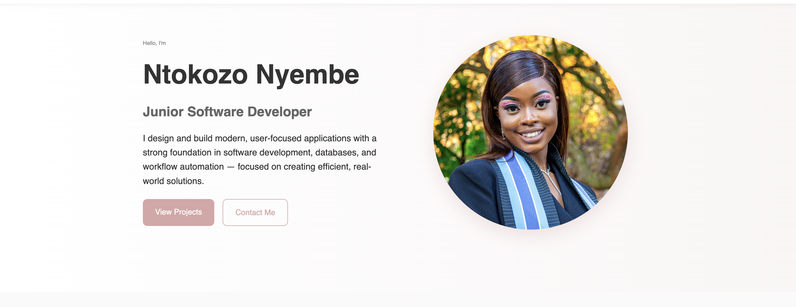

# 💼 Ntokozo Nyembe | Developer Portfolio

Welcome to my personal developer portfolio website. This project showcases my skills, projects, and experience as a Junior Software Developer.

## 🚀 Live Demo
🔗 https://developer-portfolio-swart-phi.vercel.app/

## 📸 Preview

---

## 👩🏽‍💻 About Me

I am a Junior Software Developer with 1.5 years of experience building database-driven applications and business systems. I hold a Diploma in IT (Software Development) and an Advanced Diploma in Application Development.

I have hands-on experience in C#, .NET, SQL Server, REST APIs, and Azure DevOps. I enjoy building practical solutions, designing efficient systems, and solving real-world problems.

---

## 🛠️ Tech Stack

- HTML5  
- CSS3  
- JavaScript  
- Git & GitHub  
- Vercel (Deployment)

---

## 📂 Featured Projects

### 🔹 Municipal Reporting App
A system designed to capture, manage, and track municipal service reports efficiently.

### 🔹 Quiz Application
An interactive quiz platform with dynamic questions and scoring functionality.

### 🔹 To-Do Task Manager
A simple and intuitive task management app for organizing daily activities.

---

## 🎓 Education

- **Advanced Diploma in Application Development (2025)**  
  Focused on cloud development, application security, and software engineering.

- **Diploma in Information Technology – Software Development (2024)**  
  Strong foundation in C#, SQL Server, and application development.

- **Higher Certificate in IT Support Services (2023)**  
  Core skills in IT support, troubleshooting, and networking.

---

## 📬 Contact

- 📧 Email: nnmnyembe@gmail.com  
- 🔗 LinkedIn: https://www.linkedin.com/in/ntokozo-nyembe-5842b021b 
- 💻 GitHub: https://github.com/Ntokozo-Nyembe  

---

## ⭐️ Show Your Support

If you like this project, feel free to ⭐️ the repo and connect with me!
